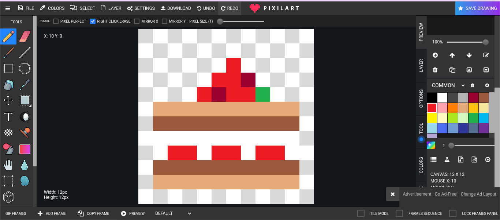
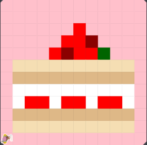

# asphalt-art-project
# Unit 1 - Asphalt Art

## Introduction

Cities use asphalt art to improve public safety, inspire their residents and visitors, and brighten communities. Your goal is to create asphalt art to revitalize The Neighborhood and bring the community together with the help of the Painter.

## Requirements

Use your knowledge of object-oriented programming, algorithms, the problem solving process, and decomposition strategies to create asphalt art:
- **Create a new subclass** – Create at least one new subclass of the PainterPlus class that is used for a component of the asphalt art design.
- **Plan an algorithm** – Use the problem solving process and decomposition strategies to plan an algorithm that incorporates a combination of sequencing, selection, and/or iteration.
- **Write a method** – Write at least one method in a PainterPlus subclass that contributes to a component of the asphalt art design.
- **Document your code** – Use comments to explain the purpose of the methods and code segments.

## Notes: Neighborhood & Painter Class

This project was created on Code.org's JavaLab platform using the built-in Neighborhood GUI output. To test and edit this project you must build in Code.org's JavaLab with the Neighborhood GUI enabled. For reference to the Painter class documentation, [you can read more here.](https://studio.code.org/docs/ide/javalab/classes/Painter)

## Output:

Sketch:

Final Drawing:

## Reflection

1. Describe your project.

My project represents all wins deserves to be celebrated no matter how big or small. Something as big as a promotion to preforming well on a test.

2. What are two things about your project that you are proud of?

The two things about my project that I am most proud of is my use of if statements and my corner methods.
I am proud of these two things because I was them as something intimidating that I was able to figure out. 

3. Describe something you would improve or do differently if you had an opportunity to change something about your project.

Something I would like to do differently if I had the opportunity to change something about my project is my lack of isFacing(direction) or currentlyFacing(direction). By implementing those pieces of code I believe my code would be more efficient and easier to understand.
